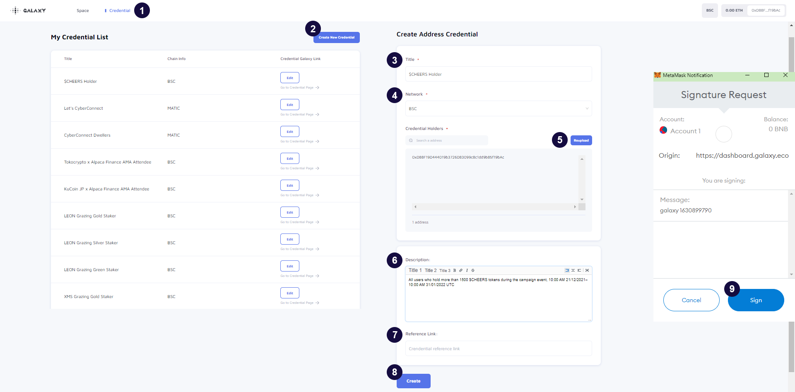

# Step 2 - Curate Credentials

## Supported Credential types

Currently we support CSV and subgraph format. Below documents how to create a credential using CSV. To create subgraph type credentials, please contact Galaxy team for assistance.

## CSV Credentials on Galaxy Dashboard

- The user can see and select all credentials from any user while creating the space campaign, but on the “Credential” - “My Credential List” page, the user can only see and edit their own created credential list.
- The user can download the existing whitelist file
- The user can easily upload addresses in batches at once with the following file requirements:
    - The file needs to be CSV format (Without Comma)
    - Each address must not be duplicated
    - The file should not contain headers
- The user can also create a reference link for credentials as needed.

## Create/edit CSV Credentials

1. Click "Credential" to go to "My Credential List" page
2. Click "Create New Credential"
3. Fill up the Credential Title
4. Select the deployed Network
5. Upload the CSV file
    1. Error Alert if CSV file contained duplicated address and invalid address
6. Fill up the Credential Description
7. Fill up the reference link (If needed)
8. Click "Create"
9. Confirm to create the Credential by clicking "Sign" on the signature request
10. Made a mistake? No worries! You can always come back to edit the credentials that you have created



## Subgraph Credentials

<aside>
💡 We are adding Galaxy dashboard support to create subgraph Credentials in a self-serve fashion. Before that, please contact Galaxy team for assistance.

</aside>

Subgraph Credential consists of: endpoint, query, expression, and header. Galaxy will send `query` to the `endpoint` with `header`, and process the returned data with `expression`. For example:

endpoint:

```
https://api.xxx.com/cred/
```

header:

```tsx
{"Authorization": "key"}
```

query:

```graphql
query getEligibility($address: String!) {
   campaignEligibility(address: $address) {
    eligible
   }
}
```

expression:

```tsx
function(data){
 if(data != null && data.campaignEligibility != null && data.campaignEligibility.eligible) {
   return 1
 }
 return 0
}
```

When `expression` returns 1, the address we checked is now confirmed to have this credential.

## Tutorial Video for Curating Credentials

[https://youtu.be/EeE2Ngv7oEo](https://youtu.be/EeE2Ngv7oEo)
